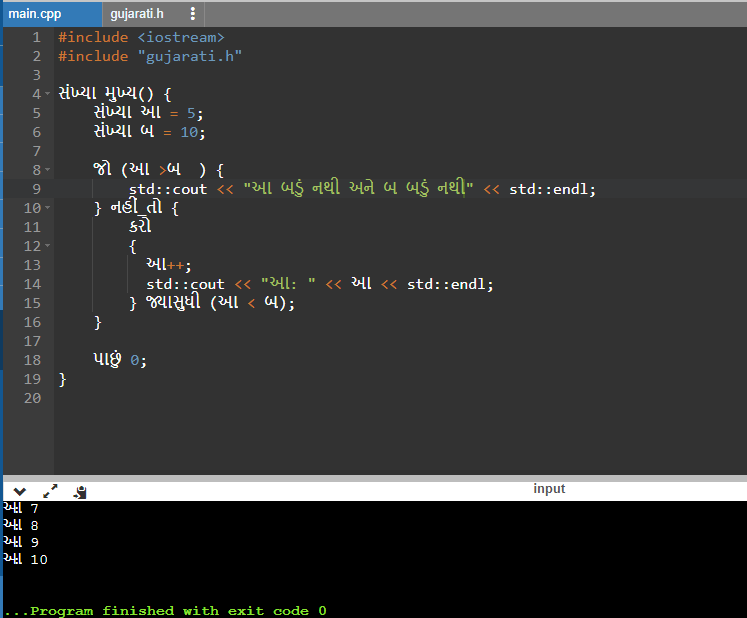

# Gujarati-CPlusPlus

# Fun Keyword Conversion - Gujarati Translation

This project demonstrates a fun keyword conversion in the C++ programming language. The goal is to provide translated versions of common programming keywords into Gujarati, a language spoken in the western part of India.

## Usage

To use the translated keywords, include the `gujarati.h` header file in your C++ program. The header file contains `#define` statements that map English keywords to their Gujarati translations.

### Example

Here's an example that demonstrates the usage of the translated keywords. Refer to the `main.cpp` file for the code implementation.

### main.cpp

```cpp
#include <iostream>
#include "gujarati.h"

// Your code goes here
```

Please refer to the `main.cpp` file for the complete code implementation.

## Screenshot



The above screenshot shows the output of the example program using the translated Gujarati keywords.

## Disclaimer

This project is purely for entertainment purposes and should not be used in professional or production environments. The translated keywords may not conform to standard programming conventions and can make the code less readable and maintainable. It's recommended to use English keywords in your code for better comprehension and collaboration with other developers.

## Credits

This project was inspired by the desire to explore and experiment with different programming language features. The translations were manually created for fun and do not aim to provide an accurate or official representation of the Gujarati language.
